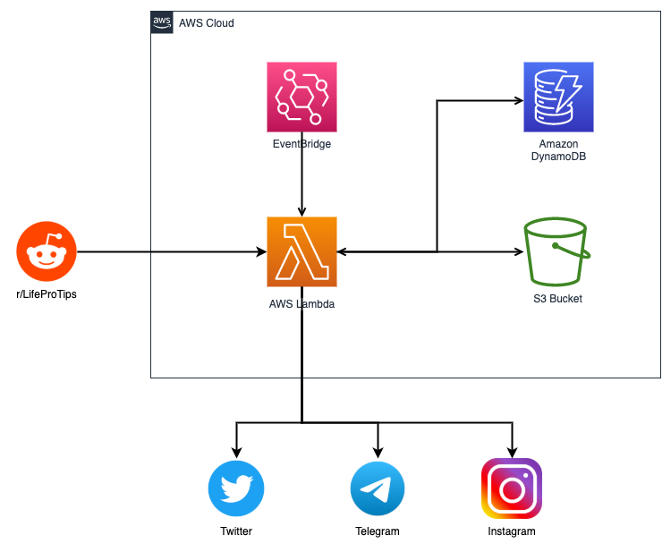

# LifeProTips [](https://github.com/buraktokman/LifeProTips/)

[](https://github.com/buraktokman/LifeProTips)
[](https://github.com/buraktokman/LifeProTips)
[](https://requires.io/github/buraktokman/LifeProTips/requirements/?branch=master)
[](https://github.com/buraktokman/LifeProTips)
[](https://choosealicense.com/licenses/mit/)
[](https://blockchain.info/address/17dXgYr48j31myKiAhnM5cQx78XBNyeBWM)
[](https://etherscan.io/address/91dd20538de3b48493dfda212217036257ae5150)

Tips that improve your life in one way or another. This software downloads life tips from [reddit.com/r/LifeProTips](https://www.reddit.com/r/LifeProTips/top/) and tweets the most upvoted tips.

------
### Warning
Before using, modify account credentials in **inc** folder.

------
### Instructions

0. Fork, clone or download this repository.

1. Navigate to the directory.

2. Install requirements.

3. Run the script.

    ```bash
    git clone https://github.com/buraktokman/LifeProTips.git
    cd LifeProTips
    pip3 install -r requirements.txt
    python3 bot.py
    ```

------
### System Design



------

### Versions

**0.1.3 beta (WIP)**

```
- [ ] WIP
- [x] History check on DynamoDB improved
```

**0.1.2 beta**

```
- [ ] WIP
- [x] Using Twitter threads for longer tips and for tips with added content
- [x] History check moved from S3 object storage to DynamoDB table
- [x] Lambda Layer creation bash script added to repository
- [x] Created dynamic structure for configuration load
- [x] First version of system design diagram added to documentation
- [x] Refactoring done
```

**0.1.1 beta**

- [x] Fetching via PRAW done.
- [x] Twitter API integration done.
- [x] AWS S3 integration done.
- [x] AWS Lambda functionality done.

---

### License

MIT License
